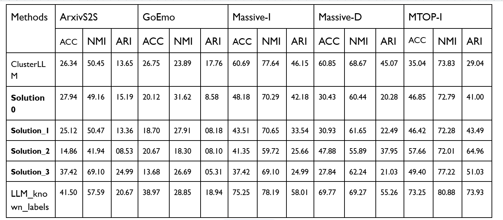

# Text Clustering via LLM

A project for clustering text documents using Large Language Models for the VAE program Université Paris Cité.

## Overview

This project leverages LLMs to perform intelligent text clustering, enabling automated categorization and organization of textual data.
This repository contains the implementation code for the paper "[Text Clustering as Classification with LLMs](https://arxiv.org/abs/2410.00927)" and several other improvements.

## Features

- LLM-based clustering pipeline 
- Efficient clustering algorithms

## Number of clusters per solution

| Method | ArxivS2S | GoEmo | Massive-I | Massive-D | MTOP-I |
|--------|----------|-------|-----------|-----------|--------|
| GT # clusters | 93 | 29 | 59 | 18 | 102 |
| Cluster LLM | 16 (-77) | 56 (+29) | 43 (-16) | 90 (+72) | 43 (-59) |
| Solution_0 | 55 | 124 | 115 | 246 | 251 |
| Solution_1 | 106 | 231 | 204 | 316 | 182 |
| Solution_2 | 33 | 7 | 41 | 38 | 79 |
| Solution_3 | 375 | 311 | 375 | 158 | 294 |

## Scores

